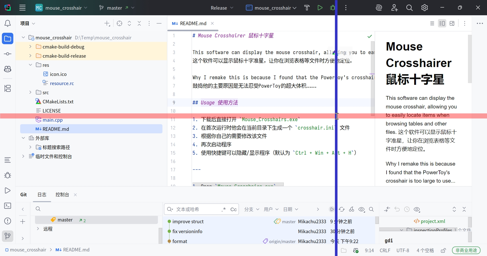

# Mouse Crosshairer 鼠标十字星



This software can display the mouse crosshair, allowing you to easily locate items when browsing tables and other files.

这个软件可以显示鼠标十字准星，让你在浏览表格等文件时方便地定位。

Why I remake this is because I found that the PowerToy's crosshair is too large to use...

鼓捣他的主要原因是无法忍受PowerToy的超大体积……

## Usage 使用方法

1. 下载后直接打开 `Mouse_Crosshairs.exe`
2. 在首次运行时他会在当前目录下生成一个 `crosshair.ini` 文件
3. 根据你自己的需要修改该文件
4. 使用 `Ctrl + Win + Alt + E` 退出
5. 再次启动程序
6. 使用快捷键可以隐藏/显示程序（默认为 `Ctrl + Win + Alt + H`）

<!--sth!-->

1. Open `Mouse_Crosshairs.exe`
2. The process would auto write a file `crosshair.ini` in the current directory
3. Modify it as you need
4. Use `Ctrl + Win + Alt + E` to exit
5. Re-start the process
6. Use the shortcut key to hide/show the crosshair (default is `Ctrl + Win + Alt + H`)

## Features 功能

1. 支持自定义十字星颜色、粗细、透明度（横线竖线可以分别设置）
2. 支持自定义快捷键
3. 支持多显示器

<!--sth!-->

1. Support customize crosshair color, thickness, transparency
   (horizontal and vertical lines can be set separately)
2. Support customize hotkeys
3. Support multi-monitor

## Usage 使用方式

参考下面的配置文件 Please see the following `ini` file as details

```ini
[Horizontal]
# No more than 200
Width = 2
# R, G, B, Alpha: 0-255
R = 255
G = 0
B = 0
Alpha = 255

[Vertical]
# No more than 200
Width = 2
# R, G, B, Alpha: 0-255
R = 255
G = 0
B = 0
Alpha = 255

[Hide_Show_Hotkey]
# Mod Support
#Ctrl, Alt, Win, Shift, 3 of them MAX.
Mod = Ctrl,Alt,Win
# Key Support
# A-Z, 0-9, F1-F12, Numpad0-Numpad9
# Space, Tab, Backspace, Escape
# VK_XBUTTON1, VK_XBUTTON2
VK = H

[Exit_Hotkey]
# Mod Support
#Ctrl, Alt, Win, Shift, 3 of them MAX.
Mod = Ctrl,Alt,Win
# Key Support
# A-Z, 0-9, F1-F12, Numpad0-Numpad9
# Space, Tab, Backspace, Escape
# VK_XBUTTON1, VK_XBUTTON2
VK = E
```
